<picture>
  <source media="(prefers-color-scheme: dark)" srcset="./dark.svg">
  <source media="(prefers-color-scheme: light)" srcset="./light.svg">
  
</picture>

  

# Hi 👋 I'm Vamsi Prasad

### Frontend Engineer • Full Stack Developer • AI Enthusiast

Building modern web experiences with beautiful UI, scalable architecture, and clean code.

---

# About Me

I'm a final-year Computer Science (Data Science) student passionate about building beautiful products, solving real-world problems, and exploring AI-powered applications.

I enjoy designing modern user interfaces, creating scalable web applications, and learning new technologies every day.

---

# Current Focus

- Modern React & Next.js
- Full Stack Development
- Artificial Intelligence
- UI/UX Engineering
- Open Source
- Cloud Technologies

---

# Tech Stack

### Languages

---

### Frontend

---

### Backend

---

### Database

---

### DevOps & Cloud

---

# Tools

---

# GitHub Analytics

---

---

# Featured Projects

Coming Soon...

---

# Connect With Me

---

### Thanks for visiting my profile ❤️

⭐ If you like my work, consider starring my repositories!

